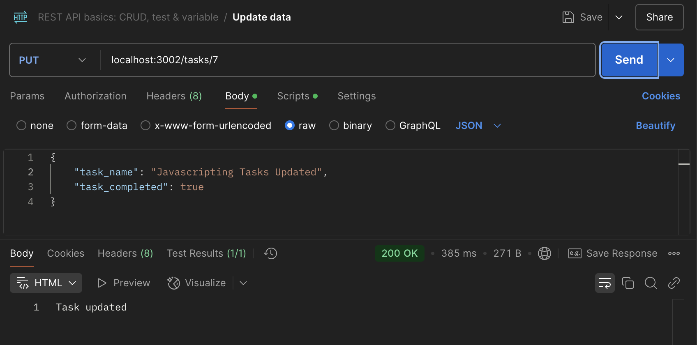

# Full-stack Vanilla JS Demo
This demo serves as a guide for creating a Proof of Concept (POC) for building a Full-Stack Web Application using Vanilla JavaScript.

### Requirements
* [Node.js](https://nodejs.org/en/download) - Runs JavaScript on the server to handle backend tasks.
* [VSCode](https://code.visualstudio.com/download) - A code editor for writing and debugging JavaScript.
* [MySQL localhost](https://www.apachefriends.org/download.html) - A database on your own computer for storing and managing data.
* [MySQL remote](https://freedb.tech/) - A database on an online server that can be accessed from anywhere.
* [Postman](https://www.postman.com/downloads/) - A tool for testing APIs and sending requests to servers.

### Run the scripts

* To run the ```server```
```bash
$ cd server
$ npm start
```

* To run the ```client```, right click the client/index.html and select "Open with Live Server"

### Setup

#### Server (Local)

1. Setup the MySQL database environment using XAMPP.
   In localhost\phpmyadmin
   ```sql
     CREATE DATABASE taskmgr
     USE taskmgr
     CREATE TABLE `Task` (
      `task_id` int NOT NULL,
      `task_name` varchar(100) NOT NULL,
      `task_completed` tinyint(1) NOT NULL,
      `task_created` datetime NOT NULL DEFAULT CURRENT_TIMESTAMP
    ) ENGINE=InnoDB DEFAULT CHARSET=utf8mb4 COLLATE=utf8mb4_0900_ai_ci;

    INSERT INTO `Task` (`task_id`, `task_name`, `task_completed`, `task_created`) VALUES
    (1, 'Complete project report', 0, '2025-02-17 06:43:37'),
    (2, 'Submit assignment', 1, '2025-02-17 06:43:37'),
    (3, 'Update project repository', 0, '2025-02-17 06:43:37'),
    (4, 'Prepare for presentation', 0, '2025-02-17 06:43:37'),
    (5, 'Review pull requests', 1, '2025-02-17 06:43:37');
   ```
2. Clone this repo.
3. Navigate to ```server > server.js``` and right-click then select Open in Integrated Terminal.
4. Install the script dependencies ```npm install```
5. Run the server script ```npm start```
6. Open a browser and verify server access by entering the following URL in the address bar: ```localhost:3000\tasks\```.
  - If you see JSON data in the browser, the server is working correctly.
  - If not, troubleshoot by reviewing the previous steps or asking your teacher for help.

#### Test API Endpoints

1. Launch Postman
2. In the Collection Menu, click create new collection (+) then select Rest API Basics
3. Select Get data then follow this:
   
5. Select Post data then follow this:
   
7. Select Put data then follow this:
   
9. Select Delete data then follow this:
   

### **🚀 Summary of API Endpoints**
| **Method** | **Endpoint**          | **Description**                   |
|-----------|----------------------|-----------------------------------|
| GET       | `/tasks`             | Retrieve all tasks               |
| POST      | `/tasks`             | Create a new task                |
| PUT       | `/tasks/:id`         | Update a task by ID              |
| DELETE    | `/tasks/:id`         | Delete a task by ID              |
| GET       | `/users`             | Retrieve all users               |
| POST      | `/users`             | Create a new user                |
| GET       | `/projects`          | Retrieve all projects            |
| POST      | `/projects`          | Create a new project             |
| GET       | `/statuses`          | Retrieve all task statuses       |
| POST      | `/assignments`       | Assign a task to a user          |
